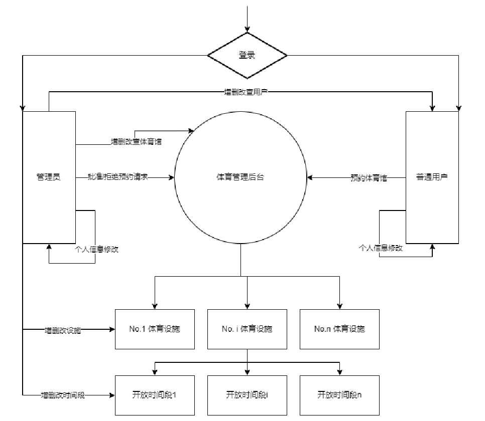

# Shanghai-Sports-Arena-Management-System
## Introduction
Traditional venue reservation and management methods encounter several issues. Firstly, manual management often suffers from low efficiency, leading to reservation conflicts and inaccurate information. Secondly, the absence of a unified information platform and systematic management tools makes it challenging to allocate and deploy venue resources effectively. Additionally, users face difficulties and inconveniences in accessing venue information and making reservations.

To address these problems, the design and development of a Shanghai Sports Arena Management System hold significant importance. This system aims to centralize the management and unified display of venue, facility, and user information by utilizing data provided by the Shanghai Open Data Platform. Administrators can allocate and manage venue resources through the system, thereby enhancing resource utilization efficiency and service quality. Users can conveniently search for and book various venue facilities, improving the convenience and experience of sports activities.

Furthermore, leveraging the technologies and methods of big data management systems, data analysis and mining can be performed on venue usage and user demands. This provides decision support and optimization suggestions for venue managers. The establishment and operation of the system can promote sports and fitness activities among city residents, thereby enhancing their health levels and quality of life.

Therefore, the design and implementation of the Shanghai Sports Arena Management System have significant practical significance and application prospects in improving the management efficiency of venue resources, meeting the sports needs of residents, and driving the development of urban sports.

## Implementation
The implementation of the Shanghai Sports Arena Management System is technically feasible, primarily based on the following points:

1. Database Management System: Use MySQL database for data storage and management. MySQL is a mature and reliable relational database management system suitable for storing and processing large amounts of structured data.

2. Backend Development Framework: Use the Flask framework for backend development. Flask is a lightweight Python web framework that is easy to learn and use, with good scalability and flexibility, making it suitable for building small to medium-sized web applications.

3. Frontend Development Framework: Use Vue.js for frontend development. Vue.js is a popular JavaScript framework that offers advantages such as reactive design and component-based development, providing a good user interface and user experience.

4. Data Integration: Obtain relevant venue, facility, and past opening time information through the Shanghai Open Data Platform.

5. User Authentication and Authorization Management: Implement user authentication and authorization management functions to ensure that only authorized administrators can perform management operations, while regular users can only make reservations and modify personal information.

## Data Flow Diagram

## Screen Shot

## Video Demonstration

